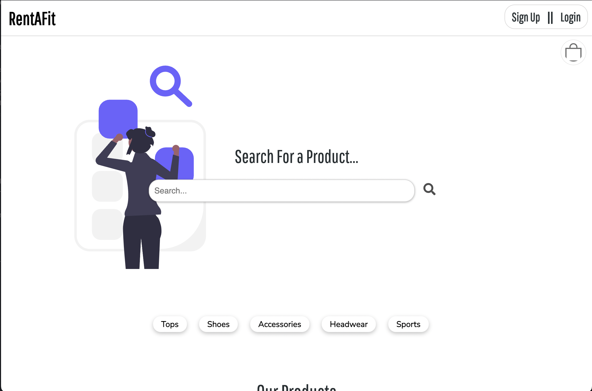

# Rent A Fit
  
  
  
  
  
  
  

  ## Description
  This project was the final group project in which we were tasked to crate a MERN stack single page application that works with real world data to solve a real world problem. Requirements for this project include: Performant JavaScript, NoSQL databases, React single page applications, GraphQL APIs, concurrent servers in a MERN app, and authenitaction. For our project we choose to create a clothing rental site where users can either post items that they would like other people to rent or search for items that they would like to rent themsevles.

  Below is a preview of the deployed application:

 

  ## Table of Contents
  * [Installation](#installation)
  * [Usage](#usage)
  * [Contributions](#contributions)
  * [License](#license)
  * [Questions](#questions)

  ## Installation
  To install you can clone this repository and run command "npm i" in the command line to install all dependencies. You can also simply navigate to the link of the deployed application (link below).

  ## Usage
  You can find the deployed applicaion [here](https://afternoon-forest-49656.herokuapp.com/).

  

  ## Contributions
  - Paul K
  - Chris S
  - Sam W

  
  ## License 
  This project is licensed under MIT 

  Permission is hereby granted, free of charge, to any person obtaining a copy of this software and associated documentation files (the "Software"), to deal in the Software without restriction, including without limitation the rights to use, copy, modify, merge, publish, distribute, sublicense, and/or sell copies of the Software, and to permit persons to whom the Software is furnished to do so, subject to the following conditions:

The above copyright notice and this permission notice shall be included in all copies or substantial portions of the Software.

THE SOFTWARE IS PROVIDED "AS IS", WITHOUT WARRANTY OF ANY KIND, EXPRESS OR IMPLIED, INCLUDING BUT NOT LIMITED TO THE WARRANTIES OF MERCHANTABILITY, FITNESS FOR A PARTICULAR PURPOSE AND NONINFRINGEMENT. IN NO EVENT SHALL THE AUTHORS OR COPYRIGHT HOLDERS BE LIABLE FOR ANY CLAIM, DAMAGES OR OTHER LIABILITY, WHETHER IN AN ACTION OF CONTRACT, TORT OR OTHERWISE, ARISING FROM, OUT OF OR IN CONNECTION WITH THE SOFTWARE OR THE USE OR OTHER DEALINGS IN THE SOFTWARE.

  ## Questions
  If you have any further questions please feel free to reach out to us via email ([Paul](mailto:kalaitzidispaul@gmail.com), [Chris](mailto:christopher.sarm15@gmail.com), [Sam](mailto:samwilliams281@gmail.com))  

  To view more of our work please visit our GitHub pages ([Paul](https://github.com/paulkalait), [Chris](https://github.com/chris-15), [Sam](https://github.com/samw281))
